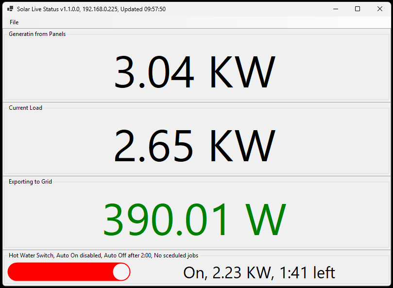

# SolarTools #

Tools for working with Enphase solar arrays and Shelly switches.

### Projects ###

1. **SolarPOC** Proof of concept for working with Enphase Envoy gateways. A CLI tool to report on the gateway.
1. **ShellyPOC** Proof of concept for working with Shelly switches. A CLI tool to report on a list of switches.
1. **SolarLiveStatusPanel** A status panel showing current generation information and the ability to switch a shelly switch on and off, this could be used to control the hot water tank.
1. **Support** Support files including prebuild versions of **SolarLiveStatusPanel**



### Running the apps###

There are prebuilt versions of the apps in the Support folder. They are either EXE files or ZIPs.

Its intended to be used on a 64 bit version of Windows.

After copying the EXE, edit the config file, a specimen file is provided.

```
{
  "shelly": {
    "devices": [
      {
        "address": "192.168.0.999",
        "type":  "1"
      }
    ]
  },
  "enphase": {
    "credentials" : {
      "user": "configure your user",
      "password": "configure your password"
    },
    "gateway": {
      "address": "192.168.0.999"
    }
  }
}
```

You need to provide IP addresses for the Envoy gateway and the Shelly switch. Also credentials for Enphase are needed to generate the token to access the gateway. The token lasts a year, once generated you can remove your credentials until the token need to be regenerated.


### Running the CLI tools ###

The CLI tools use the same config file so if you put all the EXE files in the same folder they will all use the same config.

Typical output looks like this

```
D:\Solar>SolarPOC.exe
SolarPOC v1.0.0.1
Running on .NET CLR: 8.0.20
Gateway Address: 192.168.0.xxx
User: mail@example.com
SN: 122130043898
Count: 12
ID: 704643328, Type production
ID: 704643584, Type net-consumption
ID: 704643328, Power: 678.365
ID: 704643584, Power: -245.11
ID: 1023410688, Power: 0.0
Production: 678.37 W
Current Load 433.26 W
Export to grid: 245.11 W

D:\xfer\Solar>ShellyPOC.exe
ShellyPOC v1.0.0.1
Running on .NET CLR: 8.0.20
Devices: (1)
=== Address: 192.168.0.xxx, Type: 1 ===
Device: shelly1pmg3-28372f24a984, S1PMG3, 20250924-062807/1.7.1-gd336f31, Authentication: False, Matter: False
switch:0 ID: 0, On = False
    Started At: , Duration: = not present , Remaining: = not present
    Load: 0 W, Voltage = 240.6 V
    Active Energy: 169.46 KW, TS = 24/03/2026 17:40:00, Mins = 0.000, 0.000, 0.000
    Returned Active Energy: 0 W, TS = 24/03/2026 17:40:00, Mins = 0.000, 0.000, 0.000
    Temperature: 44.4 C, 111.9 F
switch:1 not present
switch:2 not present
switch:3 not present
schedule rev = 13, num jobs = 2, enabled jobs = False
ID: 1, Enabled = False, Timespec = @sunrise+4h30m * * SUN,MON,TUE,WED,THU,FRI,SAT
    Call: switch.set
ID: 2, Enabled = False, Timespec = @sunset-3h00m * * SUN,MON,TUE,WED,THU,FRI,SAT
    Call: switch.set
switch ID 0 - config ID: 0, Mode = follow
    Auto On = False, Auto On Delay = 60 seconds
    Auto Off = True, Auto On Delay = 2:30
    Power Limit: 4.48 KW, Voltage Limit = 280.0 V, Current Limit 16 A
switch ID 0 - status ID: 0, On = False
    Started At: , Duration: = not present , Remaining: = not present
    Load: 0 W, Voltage = 240.6 V
    Active Energy: 169.46 KW, TS = 24/03/2026 17:40:00, Mins = 0.000, 0.000, 0.000
    Returned Active Energy: 0 W, TS = 24/03/2026 17:40:00, Mins = 0.000, 0.000, 0.000
    Temperature: 44.4 C, 111.9 F
=== End ===
```

### Building the projects ###

The projects are all built using Visual Studio (I used VS 2022), and written in C#.

